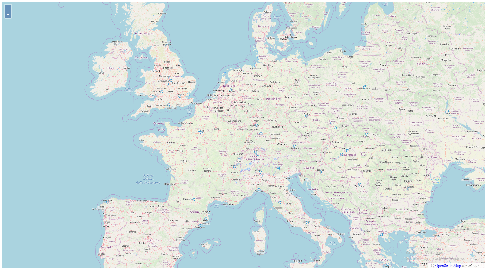

# openlayers

The first thing that I needed to do was retrieve the data from the website. To do this I created a python script to download the website because this is the language that I am most comfortable in. I split the data and read the table into a pandas dataframe. I knew that I wanted my data in a GeoJSON format, so I used the GeoJSON module to plot all of the co-ords as points in the correct format. 
I used online guides to better understand how the OpenLayers module worked and how to get started with it, as well as the examples on the official website. I then used my GeoJSON data, the output of my python file, as the GeoJSON object in my js code. This ran in the basic html template sourced from the official website.

The first time I plotted the data, all of my points were not quite on top of each other, but all very close to the origin (0, 0). For a while I couldn't work out what the problem was, but after realising a few examples online were using numbers such as 4E6 to represent co-ords, I did some more research to understand that my projection was expecting the co-ords in terms of meters (mercator) and therefore all of my results were hardly moving away from the origin (only a max of 180m away). To fix this, I modified my python script to include a conversion into the right format. 

When converting values to the correct format, one set of co-ords (Laboratory for Cartography and GIS, University of Nebraska) gave me values of inf when I converted them. I discovered that this was because the co-ords were given in the wrong order in the table on the website. The column heading uses the format long/lat and the latitude ranges from -90 to +90, but the latitude for this institution is -96. Because this was wrong, my python script will swap lat and long values around if they produce inf values to handle this situuation and any in the future.

To update the location data, just run the python script ``dataretrieve.py``. Unfortunately, you will also have to copy the GeoJSON into the ``index.js`` file as this is not automatic.

![World Map]](./src/images/overallmap.png)

